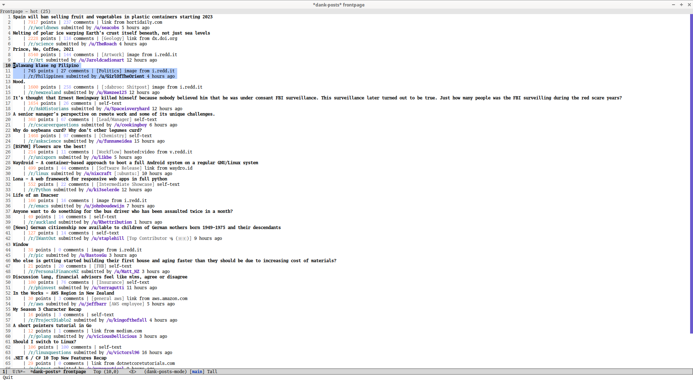

# dank-mode

Emacs major mode for browsing ~~dank memes~~ Reddit.

# Features and screenshots

- Load list of posts for your frontpage or a specific subreddit.
- Read comments for a post (nested and filled).
- Open posts and links in a browser or with EWW.
- Customizable faces.

# Install

This isn't ready for MELPA yet. To insall, download this repository
and put the files of `lisp/` in your load path.

## Minimum Emacs version

This package requires at least Emacs version 27.1.

## 3rd-party packages

This package doesn't require any 3rd party packages.

If `markdown-mode` is available, it will be used to do paragraph
filling.

# Authentication

All requests to the Reddit API must be authenticated.

To authenticate, you will need to generate your own Reddit API client
id and secret.

This can be done via https://www.reddit.com/prefs/apps.  When creating
the application, choose the **script** option, as it will only be used
by you. Feel free to leave the other fields as empty. The client id
will be written right under the application name. The client secret
will be labeled as **secret**.

Once you have your Reddit API client id and secret, you can start
`dank-mode` with `M-x dank-mode`. You will be prompted to enter the
client id and secret, and your Reddit username and password.

You will also be prompted for the option to encrypt the client secret
and password when it is cached on disk (defaults to
`~/.emacs.d/dank-mode/auth.plstore`). The benefits of this is limited,
as the secret and password will be cached in memory so any Emacs library
can read them, but at least other programs can't read them from disk.

(Note about the old `auth.json` file: if you already have the
`auth.json` file from older versions of this package, it will
automatically be upgraded to the new `auth.plstore` file. It will
remain unencrypted. If you wish to encrypt it, delete the
`auth.plstore` file and restart `dank-mode` to get the prompts.)

# Usage instructions

## Quick tutorial

### Frontpage and subreddits

Open your frontpage with `M-x dank-mode`. If this is your first time
running `dank-mode`, you will be prompted for your credentials (see
**Authentication** above). You will then be taken to a new buffer with
the frontpage posts sorted by `hot` (the default).

This buffer will have the `dank-posts-mode` major mode enabled.
The "active" post under `point` will be highlighted.
Navigate between posts with `n` (down) and `p` (up).

To open the post link in your browser, press `C-x l b`. Alternatively,
to open the post link with `EWW`, press `C-x l l`.

To navigate to a specific subreddit, press `C-x C-f`. You will be
prompted to enter the subreddit name. A list of your subscribed
subreddits will be available for autocompletion, but specifying a
subreddit not in this list will also work.

Alternatively, to navigate to the subreddit under `point`, press `C-x
C-/`.

To load the next page, press `C-x C-v`. To refresh, press `C-x C-r`
(this will reset the page count).

To change the posts sorting, press `C-x C-s`.

### Comments

To read the comments of the active post, press `C-x C-o`. This will
create a new buffer in `dank-comments` mode for the post's comments.
Navigating between comments is done similarly with `n` and `p`.

To jump between sibling comments, press `M-n` or `M-p`.  To jump to
the parent comment, press `P` (`Shift-p`).

To load more comments, navigate to that "load more" comment and press
`C-x C-o`. If it's a small enough comment tree the comments will be
inserted into the current buffer. If it's not, the comment tree will
be opened in a new buffer.

To fold/unfold a comment tree, press `TAB`.

To quit the comment buffer and go back to the frontpage or subreddit
buffer, press `C-x q`.

### Other commands

To view the full list of commands, refer to the mode help page `C-x h m`.

# Roadmap

- [ ] Better auth (e.g. don't require providing password in plaintext)
- [ ] Multi-reddits
- [ ] Upvote/downvote posts and comments
- [ ] Reply in comments
- [ ] Submitting posts
- [ ] Search

See `TODO.org` for more details.

## Maybe:

- Saving posts and comments
- Viewing the user's saved/upvoted/replied posts and comments

## Out of scope:

These are features I don't use and don't intend to implement anytime soon:

- moderating
- live threads
- polling
- private messages
