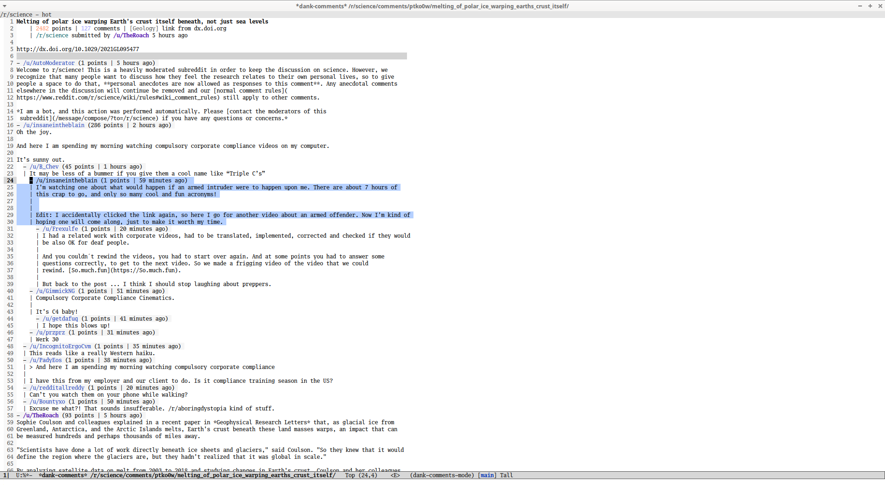

# dank-mode

Emacs major mode for browsing ~~dank memes~~ Reddit.

# Features and screenshots

- Load list of posts for your frontpage or a specific subreddit.
- Read comments for a post.
- Open posts and links in a browser or with EWW.

# Install

This isn't ready for MELPA yet. To insall, download this repository
and put the files of `lisp/` in your load path.

## 3rd-party packages

This package requires the following packages:

- `s.el`
  - https://github.com/magnars/s.el (available on MELPA)
  - Parsing and formatting Reddit content means a lot of string
    operations and transformations. `s.el` provides some convenient
    methods for this.
- `request.el`
  - https://github.com/tkf/emacs-request (avaialble on MELPA)
  - Used for communicating with the Reddit API.
- `markdown-mode`
  - https://jblevins.org/projects/markdown-mode/ (available on MELPA)
  - Reddit content is mostly Markdown. It makes sense to use the
    Markdown package to help with formatting.

# Authentication

All requests to the Reddit API must be authenticated.

To authenticate, you will need to generate your own Reddit API client
id and secret.

Once you have your Reddit API client id and secret, save them in the
`dank-auth-file` file (defaults to `~/.emacs.d/dank-mode/auth.json`).

You will also need to provide your Reddit username and password in the
same file.[1]

See the sample file `example.auth.json` for an example of this
`dank-auth-file` file.

[1]: Ideally, you shouldn't have to provide your **plaintext password** to use this package. But to perform the complete OAuth2 dance with Reddit's servers, a client server will have to be running to receive the access tokens. This is planned for a future iteration.

# Usage instructions

# Goals
